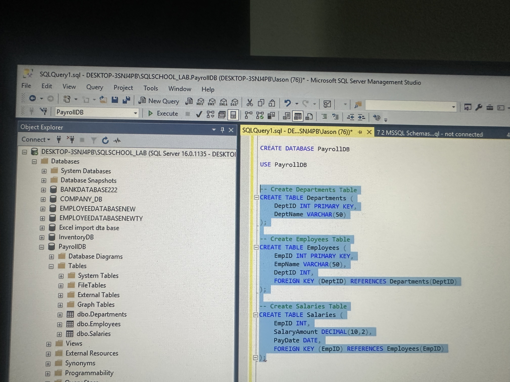
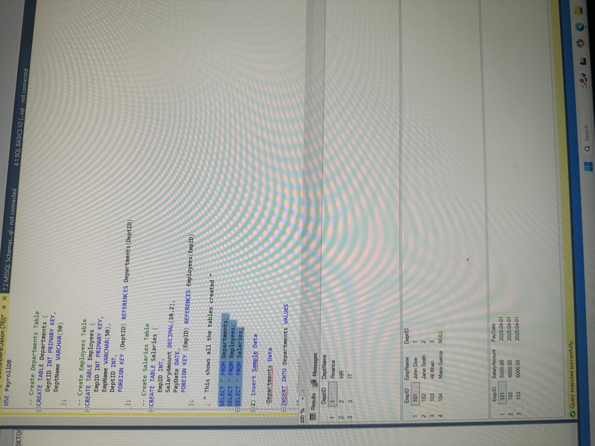
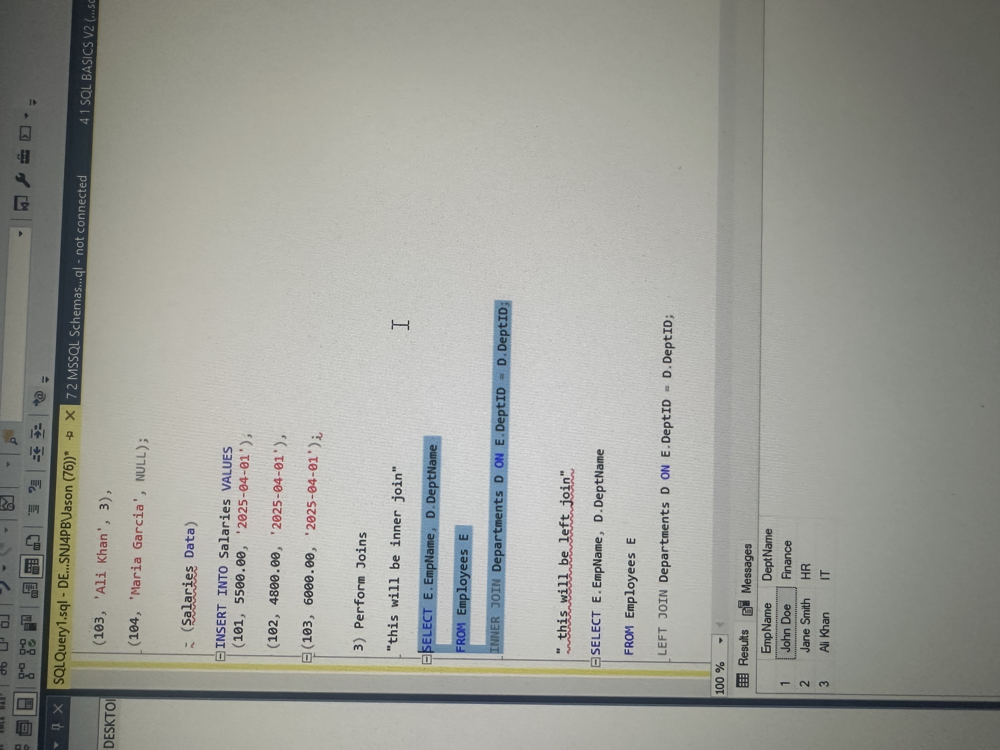
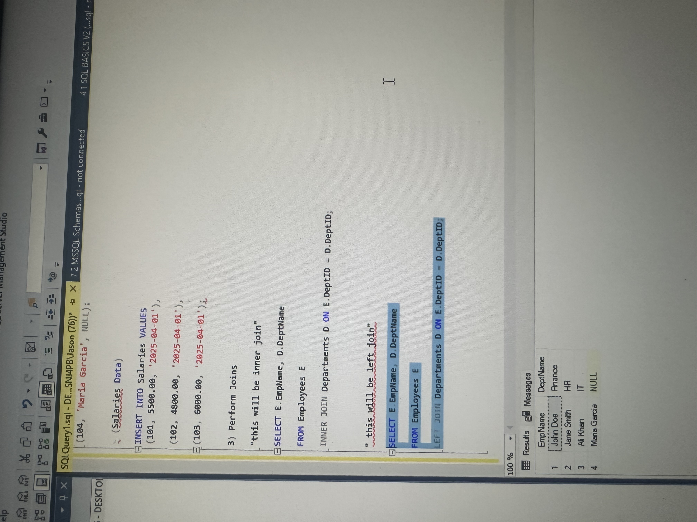
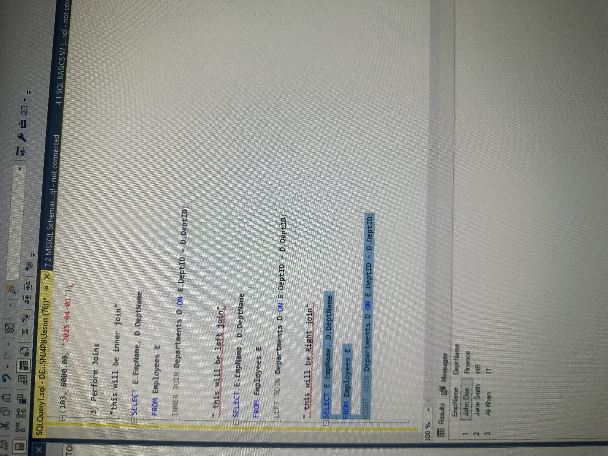

# PayrollDB-Join-Project

**SQL project demonstrating database creation and join operations**

---

## PayrollDB – SQL Joins Project

### Objective
Designed and created a relational database to simulate a company's payroll system, showcasing SQL JOINs to retrieve connected data across multiple tables.

---

### Tools Used
- SQL Server Management Studio (SSMS)
- Microsoft SQL Server

---

### What I Did
- Created a database called `PayrollDB`
- Built three tables: `Departments`, `Employees`, and `Salaries`
- Inserted sample data into each table
- Used `INNER JOIN`, `LEFT JOIN`, `RIGHT JOIN`, and `FULL JOIN` to combine employee, department, and salary information

---

### Skills Demonstrated
- Relational database design
- Data modeling with foreign keys
- SQL scripting
- JOIN operations in SQL

---

### Sample Query

```sql
SELECT E.EmpName, D.DeptName
FROM Employees E
INNER JOIN Departments D ON E.DeptID = D.DeptID;


## Screenshots

### 1. Created Table (Departments)


### 2. All Tables Created


### 3. INNER JOIN Result


### 4. LEFT JOIN Result


### 5. RIGHT JOIN Result



